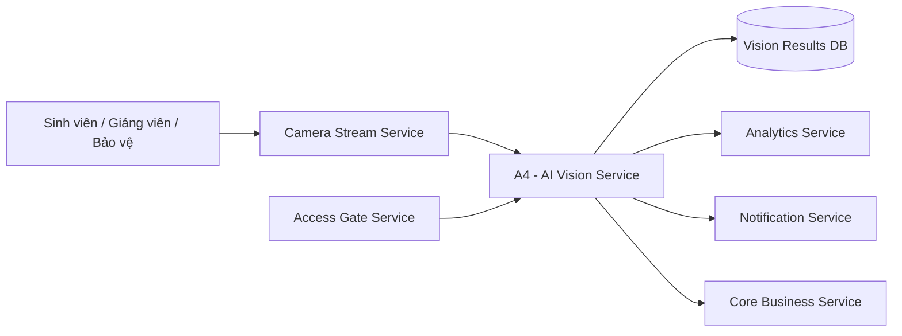

# Service Boundary - A4 AI Vision Service

## 1. Thông tin nhóm

- Tên nhóm: 3 Đình
- Lớp: CNTT 17-08
- Thành viên:
  - Nguyễn Thanh Tùng
  - Nguyễn Đức Anh
  - Lê Văn Vượng
- Mã nhóm/đề tài: A4
- Sản phẩm: Product A - Smart Campus Operations Platform
- Service phụ trách: AI Vision
- Tên đề tài: Xây dựng dịch vụ AI phân tích hình ảnh
- Bối cảnh: môi trường giáo dục thông minh khép kín

## 2. Actor

- Sinh viên, giảng viên, nhân viên và khách trong khuôn viên giáo dục.
- Nhân viên bảo vệ/vận hành, người cần xem sự kiện bất thường từ camera.
- Quản trị viên hệ thống, người cấu hình model, ngưỡng cảnh báo và vùng quan sát.
- Service khác trong hệ sinh thái: Camera Stream, Access Gate, Analytics, Core Business, Notification.

## 3. System Boundary

Nhóm xây dựng service AI Vision nằm trong Smart Campus Operations Platform. Service nhận ảnh/frame hoặc URL stream từ camera, chạy model AI để phân tích hình ảnh, sinh ra kết quả nhận diện/đếm đối tượng/phát hiện sự kiện, rồi cung cấp kết quả cho service khác.

Phần nhóm kiểm soát:

- API của AI Vision Service.
- Xử lý ảnh đầu vào, validate metadata, lưu kết quả phân tích.
- Tích hợp model computer vision, ví dụ YOLO/OpenCV.
- Sinh event kết quả cho Analytics/Notification/Core Business.
- Health check, logging và cấu hình ngưỡng cảnh báo.

Phần nhóm chỉ tích hợp:

- Nguồn camera/stream do Camera Stream Service cung cấp.
- Thông tin khu vực, lớp học, cổng vào/ra hoặc lịch học do Core Business/Access Gate cung cấp.
- Kênh gửi cảnh báo do Notification Service phụ trách.
- Báo cáo tổng hợp do Analytics Service phụ trách.

## 4. Service Boundary

AI Vision Service có trách nhiệm:

- Nhận frame ảnh, image URL hoặc snapshot từ Camera Stream Service.
- Phân tích hình ảnh để phát hiện người, đếm số lượng, nhận diện sự kiện bất thường trong khuôn viên giáo dục.
- Gắn kết quả với camera, khu vực, thời gian và độ tin cậy.
- Cung cấp API truy vấn kết quả phân tích theo camera, khu vực, thời gian.
- Phát sinh event khi có sự kiện cần cảnh báo, ví dụ quá đông người, xâm nhập khu vực hạn chế, không có đồng phục/khẩu trang nếu đề bài mở rộng yêu cầu.

AI Vision Service không làm:

- Không trực tiếp quản lý thiết bị camera vật lý.
- Không stream video real-time cho người dùng cuối.
- Không quyết định nghiệp vụ cuối cùng như cho phép/từ chối vào cổng.
- Không gửi SMS/email/push notification trực tiếp.
- Không tạo dashboard phân tích tổng hợp thay cho Analytics Service.

## 5. Input / Output

### Input

- Ảnh dạng multipart upload.
- Image URL/snapshot URL từ Camera Stream Service.
- Metadata: `camera_id`, `area_id`, `timestamp`, `source_service`, `frame_id`.
- Cấu hình phân tích: model name, confidence threshold, danh sách class cần phát hiện.

### Output

- Danh sách đối tượng phát hiện: class, confidence, bounding box.
- Kết quả đếm số lượng người/đối tượng theo frame.
- Vision event: loại sự kiện, mức độ nghiêm trọng, camera, khu vực, thời gian.
- Trạng thái xử lý: pending, processing, completed, failed.
- Log/trace id để truy vết lỗi tích hợp.

## 6. API dự kiến

| Method | Endpoint | Mục đích |
|---|---|---|
| GET | `/health` | Kiểm tra service đang sống |
| POST | `/vision/analyze` | Gửi ảnh hoặc image URL để phân tích |
| POST | `/vision/events` | Nhận/sinh event phân tích từ frame camera |
| GET | `/vision/results/{result_id}` | Lấy chi tiết kết quả phân tích |
| GET | `/vision/results` | Lọc kết quả theo camera, khu vực, thời gian, loại sự kiện |
| GET | `/vision/cameras/{camera_id}/latest` | Lấy kết quả mới nhất của một camera |
| POST | `/vision/models/reload` | Reload model/cấu hình, chỉ dành cho admin |

## 7. Phụ thuộc service khác

Service này gọi đến:

- Camera Stream Service: lấy snapshot/image URL hoặc metadata frame.
- Core Business Service: lấy thông tin khu vực, lớp học, lịch hoạt động, ngưỡng quy tắc nghiệp vụ.
- Access Gate Service: đối chiếu camera/khu vực cổng vào ra nếu event liên quan an ninh.

Service khác gọi đến AI Vision:

- Analytics Service: lấy kết quả phân tích để tổng hợp chỉ số.
- Notification Service: nhận event cần cảnh báo đã được AI Vision sinh ra.
- Core Business Service: lấy kết quả phân tích để hỗ trợ quy trình vận hành.

## 8. Sơ đồ minh họa

